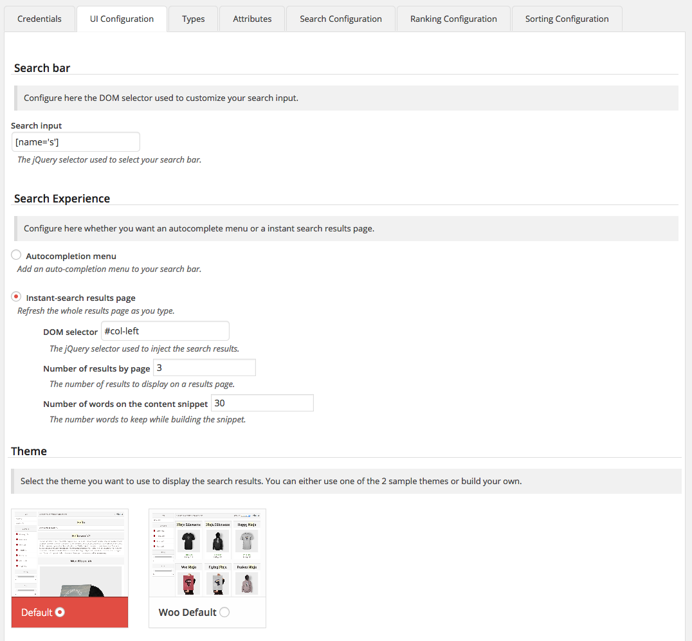
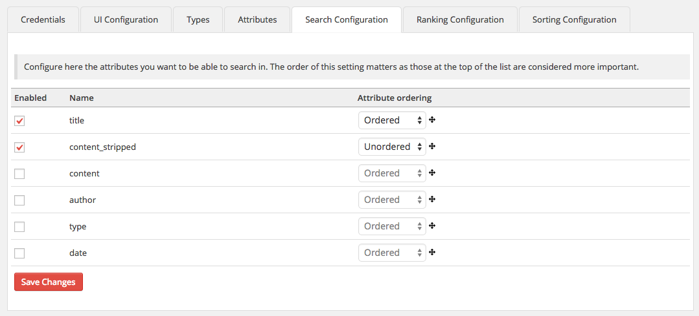

# Algolia Realtime Search Wordpress Plugin

[Algolia Search](http://www.algolia.com) is a hosted full-text, numerical, and faceted search engine capable of delivering realtime results from the first keystroke.

This plugin replaces the default search of Wordpress with an Algolia realtime search. It has been designed to support plugins like WooCommerce in addition to the standard blog system.


## Installation

1. Create an [Algolia account](https://www.algolia.com/users/sign_up)
2. Once logged in, go to the *Credentials* section and get your **Application ID** & **API keys**
3. Install Algolia Wordpress Plugin in your Wordpress dashboard
4. Activate the plugin through the *Plugins* menu in Wordpress
5. Go to the **Algolia Search** left menu configuration page and fill the your API keys
6. Configure the way Algolia is indexing your objects.

## Configuration

### Credentials

In this section you configure two things:

   1. **Your Application ID & API keys (credentials)**:

   You need to choose which api keys to use. You can go [https://www.algolia.com/licensing](https://www.algolia.com/licensing)

   2. **Your index names prefix**:

   The plugin will create several indices:

    * 1 index for the instant search
    * 1 index for each section of the auto-completion menu
    * 1 (slave) index for each sort order you enable


### UI Integration

#### Search Exprerience Configuration

   1. **Search Bar**

   To be able to trigger the search at each keystroke on your site you need to specify where the plugin is supposed to find the search input. You do that by specifying a jQuery/DOM selector.

   In Wordpress's default theme it is: `[name='s']`

   2. **Search Experience**

   The plugin let you choose between two different experiences: an autocompletion menu and/or an instant search results page.

     * **Autocompletion menu**

      This experience adds an autocompletion menu to your search bar. In this menu you will have a section for each type & taxonomy you enable (page, post, category, tag...).

      You need to specify the maximum number of result you want to display in each section.

     * **Instant search**

     This experience refreshes the whole results page as you type. At each keystroke, the plugin refreshes your whole search results page: including hits, facets & pagination.

     You need to indicate the jQuery/DOM selector specifying where the plugin is supposed to inject your results.

     You can also configure the number of results you want by page.



#### Themes

The plugin supports themes which allows you to customize the way your results are displayed. You can choose one of the 2 sample themes or build your own.

The theme is **totally independent** from the Wordpress theme. The default themes handle both Autocompletion **AND** Instant-search results page.

### Types

You can choose the Wordpress types you want to index. By default, only `post` and `page` are configured. If one of your extensions (WooCommerce for instance) creates new types you will see them in this list.

You can order them to change the order of each section of the autocompletion menu. In autocompletion menu mode you can also specify the label used for each type to display the title of search section.


### Attributes

You can configure additional attributes or taxonomies you want to index. If you use Wordpress as a blog you shouldn't have to change anything. When using Wordpress with plugins like WooCommerce this should be very useful as you probably want to index the `price` or the `total_sales` attributes as well.

When you enable an attribute, the plugin will add this attribute to the record but **it will NOT be searchable UNLESS you enable it in the Search Configuration tab**.

When you make an attribute facetable **AND if you are in Instant Search Results Page mode** you will see a faceting/filtering bloc appears in which you can filter your results easily.

There is two facet types you can choose:

  1. **Conjunctive**

	  Your refinements are ANDed. Think about a post having the tags `lifestyle` AND `mood`.

  2. **Disjunctive**

	  Your refinements are ORed. Think about a products search with: `4` OR `5` stars.
	  
  3. **Custom: slider, tag clouds, ...**

  	  A theme can declare new facet types. The default one is adding the "slider" type.

You can add a label to each enabled facet to display the Facet bloc title. You can also order the facet blocs ordering the attributes.


### Search Configuration

For each attribute you enable, you can decide to make it searchable. You can also choose if you want the attribute to be consider ordered or not:

   1. **Ordered**

      Matches at the beginning of an attribute **will be** considered more important than matches at the end. This setting is recommended for short attributes like `title`.

   2. **Unordered**

   Matches at the beginning of the list **will not be** considered more important than matches at the end. This setting is recommended for long attribute like `content`.

**Notes:** If an attribute does not appear in this tab, be sure that you first enabled it on the <b>Attributes tab</b>.



### Results Ranking

For each attribute you enable, you can make them part of your custom ranking formula.

**Notes:** Attributes that you enable here <b>NEED to be numerical attributes</b>.


### Sorting

For each attribute or taxonomy you enable you can select the ones you want to sort with.

**Notes:** Adding a new sort order will create a slave index with the exact same settings except the ranking formula will have the use the attribute you enable as the first ranking criterion. You can choose a label which will be displayed on the instant search result page.


## Build your theme

You can build your own search theme to make the search results look exactly like your current Wordpress theme. The simplest way to do that is to copy one of the two default themes and work from there.  In most cases the only thing you will need to do is modify the `templates.php` file so that you can put you **own DOM/CSS elements to the template**.

**Notes:** Remember: there is no link between the Wordpress theme and the plugin theme.

### Folder architecture

A theme is composed by several **MANDATORY** files:

- `config.php`

	It should look like

	```php
	<?php

	return array(
      'name'                      => 'Woo Default',
      'screenshot'                => 'screenshot.png',
      'screenshot-autocomplete'   => 'screenshot-autocomplete.png'
      'facet_types'               => array()
	);
	```

	The `name` will be displayed on the UI Page: it's your theme's name. And the screenshot and screenshot-autocomplete is the path of your instant search **AND** autocompletion menu screenshots (**relative to your theme root directory**).

- `styles.css`

  This file contains every CSS rules used by the theme.

- `templates.php`

  This file contains all the HTML (we use Hogan.js) templates you need. The **mandory** content are:

  ```php
  <script type="text/template" id="autocomplete-template">
  /* Your autocomplete Hogan template HERE */
  </script>

  <script type="text/template" id="instant-content-template">
  /* Your instant search results Hogan template HERE */
  </script>

  <script type="text/template" id="instant-facets-template">
  /* Your facets template HERE */
  </script>

  <script type="text/template" id="instant-pagination-template">
    /* Your Pagination template HERE */
  </script>
  ```

- `theme.js`

  This file includes all the JavaScript logic.


### Customize the `theme.js` file

You have access to the following things:

#### The `algoliaSettings` variable

This global JS variable contains every settings coming from the Wordpress back-end. It is defined on the AlgoliaPlugin.php as follow:

```php
$algoliaSettings = array(
            'app_id'                    => $this->algolia_registry->app_id,
            'search_key'                => $this->algolia_registry->search_key,
            'indexes'                   => $indexes,
            'sorting_indexes'           => $sorting_indexes,
            'index_name'                => $this->algolia_registry->index_name,
            'type_of_search'            => $this->algolia_registry->type_of_search,
            'instant_jquery_selector'   => str_replace("\\", "", $this->algolia_registry->instant_jquery_selector),
            'facets'                    => $facets,
            'number_by_type'            => $this->algolia_registry->number_by_type,
            'number_by_page'            => $this->algolia_registry->number_by_page,
            'search_input_selector'     => str_replace("\\", "", $this->algolia_registry->search_input_selector),
            'facetsLabels'              => $facetsLabels,
            "plugin_url"                => plugin_dir_url(__FILE__)
        );
```

#### The `engine` variable (defined in `front/main.js`)

You will have access to every function and attribute define in the `front/main.js`. You use the functions in this variable as a starting point to make your own or you can use it directly. Those function are the following:

**setHelper**: To use the engine you should set the AlgoliaSearchHelper at the beginning of your code

**updateUrl**: Save the refinements to the url

**getRefinementsFromUrl**: Load the refinements from the url and make a query with those refinements

**getFacets**: Make an object you can use to render your facets template

**getPages**: Make an object you can use to render your page template

**getHtmlForPagination**: Return the rendered hogan template for pagination

**getHtmlForResults**: Return the rendered hogan template for results

**getHtmlForFacets**: Return the rendered hogan template for facets

**gotoPage**: Set the current page when your are in instant search mode

**getDate**: A function that allow you to get a readable date from timestamp you can use like that in your hogan theme:

```html
{{#getDate}}{{date}}{{/getDate}}
```

**sortSelected**: A function that return "selected" if the parameter is equals to the current sort. You can use in that way in your hogan theme :

```html
<input {{#sortSelected}}name_of_the_index{{/sortSelected}} />
```

## FAQ

### Are my other plugins compatible?

It depends :) The plugin handles every other plugins that uses the `post` and `meta` tables of Wordpress. If a plugin creates its own tablem the plugin will not be able to see it.

### How do I handle a non-supported plugin?

If you want to integrate a plugin that is not handled out of the box, you will need to dive into the plugin source code since there is no way to handle it in a generic way.

### What If I want to add some attributes to snippet?

In the `algolia.php` file in the root directory of the plugin you can change the following two lines:

```php
$attributesToSnippet    = array("content");
```

For the attributes to snippet you can add a length **EXCEPT for "content" which is set from the params in UI integration**. If you add an attribute it should look like

```php
$attributesToSnippet    = array("description:30");
```

### What happens if I modify a setting from the Algolia dashboard?

The plugin tries to merge the settings that have been modified from the Algolia dashboard and the one generated from your plugin configuration. In every case the following settings will be erased:

1. For the autocompletion-menu
  * `attributesToIndex`
  * `attributesToHighlight`
  * `attributesToSnippet`

2. For the instant search results page
  * `attributesToIndex`
  * `attributesForFaceting`
  * `attributesToSnippet`
  * `customRanking`
  * `slaves`
  * `ranking` (only for the sorting (slaves) indexes)

### I want to change a facet value for example the "Types" facet, what should I do ?

In your theme `theme.js` file in the root directory of the plugin you may want to add those attributes to this line:

```javascript
window.facetsLabels = {
    'post': 'Article',
    'page': 'Page'
};
```

For example if you want to replace "product" by "Products" in the facets elements, it will look like this:

```javascript
window.facetsLabels = {
    'post': 'Article',
    'page': 'Page',
    'product': 'Product'
};
```

This works for any other facet but the Type one is the most likely to have non wanted formating.

### I saved my configuration but I do not see any change on my results?

When you change a setting that impacts the index you may want to use the **Re-index data** button to reflect your changes in your Algolia index.
