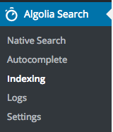
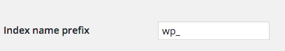
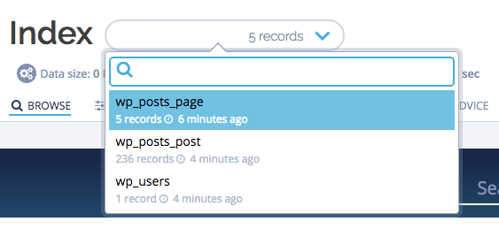
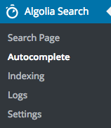
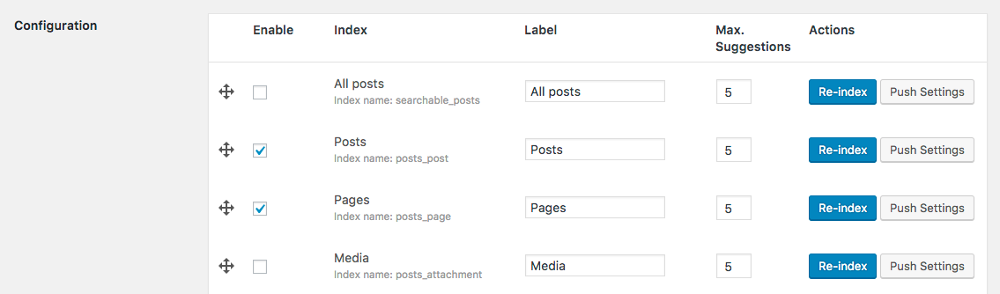
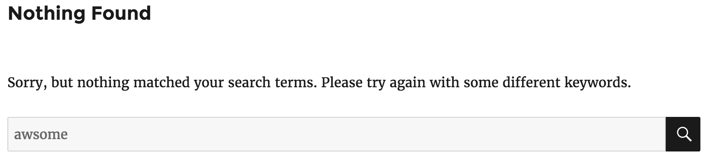
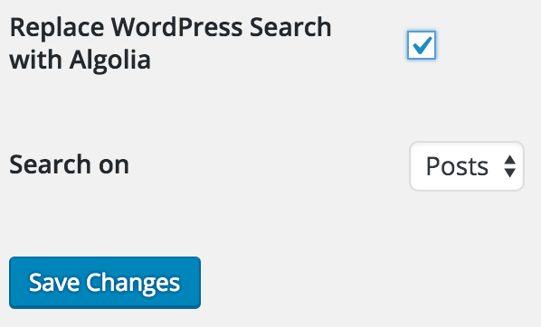
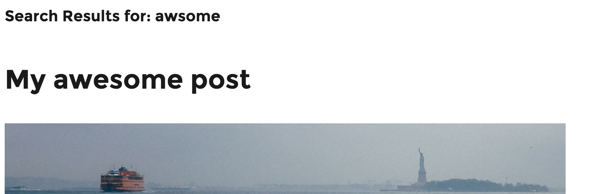

## Algolia Credentials

When connected to the WordPress admin panel, search for the following Algolia Search entry in the left sidebar, and click on it.

You will face the following form asking for your Algolia credentials.

If you have no Algolia account yet, you can create one in a few seconds for free [over here](https://www.algolia.com/users/sign_up).

Once you have created your account and you have signed in, access your Algolia API keys by following [this link](https://www.algolia.com/api-keys).

From that screen you will be able to copy/paste the following necessary keys from the Algolia dashboard to your WordPress admin form:
- Application ID
- Search-Only API Key
- Admin API Key

Copy/pasting these keys manually is very error prone, fortunately there is a convenient little copy button at the right side of each key that will make this easy.

Once you have filled in the 3 required keys, click on the `Save Changes` button at the bottom of the form.

If you provided the correct keys, a green success message will appear, otherwise you will get an error message.

If you do get an error message, please ensure that you have correctly copy pasted the right key in the right WordPress admin field. Also be sure to use the copy button as showed earlier.

**For security reasons, the Search-Only API key should only have the `search` ACL has it will be display publicly in your html templates.**

## Indexing

Once you have correctly provided WordPress with your Algolia keys as explained in [the previous step](#algolia-credentials), you will now see that the Algolia Search menu entry has now expanded:

For now, lets head to the `Indexing` entry where you will be able to tell WordPress which indices you want to synchronize with Algolia.

You should now be facing a list of checkboxes like:

**Please note that if you have already installed third party plugins to your WordPress installation, you might have more entries than in the above screenshot which is perfectly fine.**

The Algolia Search plugin uses WordPress core features such as Post Types, Taxonomies or Users to find potential content types to index.

Any plugin creating new Post Types or Taxonomies will automatically be listed here an eligible for synchronization with Algolia.

Let's proceed by choosing the indices you want to make searchable on your website, for example `Posts`, `Pages` and `Users`.

Simply check the corresponding checkboxes and click on `Save Changes`.

Green validation messages should confirm that the selected indices are about to be synchronized with Algolia.

Your data will now be pushed asynchronously behind the scenes, and it might take a few seconds. You can track what is happening by navigating to the `Logs` page of the plugin.

**For performances reasons, logging will only occur if `WP_DEBUG` is defined to `true`.**

On the same page you will also see an text field called `Index name prefix` which defaults to `wp_`.

By changing this you will update all the synchronized indices prefixes. This feature comes in handy when you want for example to use a same Algolia account for staging and production.

In that case you would use for example `wp_staging_` and `wp_production_` for respectively staging and production environments.

**Changing the index name prefix will automatically queue a move task to make existing indices adopt the new convention. No need to re-index everything after this kind of change.**

## Verify Synchronization

At this stage indices you selected in the [previous step](#indexing) should now be available in Algolia.

If you want to make sure the synchronization has succeeded you could go to your Algolia dashboard, on the [indices page](https://www.algolia.com/explorer).
From the dropdown near the title, you should see the 3 indices we chose to push from WordPress to Algolia.

If your indices do not appear yet, you may want to check your logs. [Read more about logs here](logs.html).

**Note that there can be more than 1 record per Post entry. To understand why, please read [our section about Indexing Schemas](index-schema.html).**

## Autocomplete

Now that Algolia knows about your content, it is time to offer your users a nice `as you type` search experience.
First of all, here is the search experience you will get out of the box at the end of this section:

To enable the Autocomplete feature, navigate to the `Autocomplete` admin page from the Algolia Search admin menu entry:

You should see the following:

You are able to enable or disable the autocomplete feature at any time by simply checking or un-checking the checkbox.
For now, check the box!

You should now see that the form has expanded as follow:

From here there are a couple of settings that you can customize.

|setting name    |description
|----------------|-----------
|Enable          |Make search results for this index available through the autocomplete.
|Index           |The name of the index, this is just here for you to know what each row is about.
|Max. Suggestions|The maximum number of suggestions to display for this index. Only the `n` most relevant search results will be displayed for this index, and the others will be discarded.
|Position        |Determines the display position of suggestions in relation to the other autocomplete enabled indices. The bigger the position, the lower the section will be in the display.

Let's keep the default settings and enable all 3 content types for the `as you type` autocomplete experience. Do not forget to hit the `Save Changes` buttons once your finished.

You should now be able to use the Algolia powered autocomplete on your website.

## Native Search

This feature is a bit more complex to understand but once you get it, you will understand why it plays so nicely with the [previously discovered autocomplete feature](#autocomplete).

WordPress has a built in search engine relying on SQL queries. The problem is that it does not support the features of the Algolia search engine like typo tolerance, custom ranking, and a lot more that you can check out on the https://www.algolia.com/ website.

This is the very reason this plugin comes with a feature that overrides the native WordPress search engine with Algolia. This ensures that you get the same results between the `autocomplete` feature and the native search pages.

### Let's Make It Obvious

Let's say you have a post titled: `My awesome post` and you search into your autocompleted search input for `awsome`.
The Algolia search engine is smart enough to understand that you made a typo on the word `awesome`, and will give relevant results:

If you where now to press the return/enter keyboard key without directly clicking on the giving suggestion, you will be redirected to the native WordPress search results page, but with no results:

### Let's fix the WordPress Native Search

Leat's head back to the WordPress admin interface and click on the `Native Search` entry under the `Algolia Search` menu entry.

Here is what you will see:

To enable the WordPress search override, simply check the checkbox.
You will now see an additional configuration option:

The second option lets you customize on what index you want to search on. By default WordPress results will contain all `searchable` post types.

You have 2 choices here. You can either limit the resultset to a give post type index like `pages`, or you can use the `All searchable post types`.

The later will act as a drop in replacement for the WordPress search and is generally advised.

If `All searchable post types` does not appear as an option you would have to synchronize it first on the `Indexing` page.

If we now go back to our previous experimentation and we reach the stage where we access the native WordPress search results page, we now see that we get our expected result:

**We highly recommend you turn this feature on if you also have turned on the autocomplete feature. Otherwise, it might lead to a confusing user experience!**

### Final Word about the Native Search override

The nice part of the way we override the native WordPress search engine is that your templates will remain un-altered.
This means that you can use this plugin without the fear of breaking your look & feel.

## From Here On Out

You want to understand more in depth what Algolia is and how you can benefit from it?

Please consult your gettting started: https://www.algolia.com/doc/getting-started

Struggling with something? Go to the [Q&A section](frequently-asked-questions.html).

If you are a developer, please read the advanced sections.

