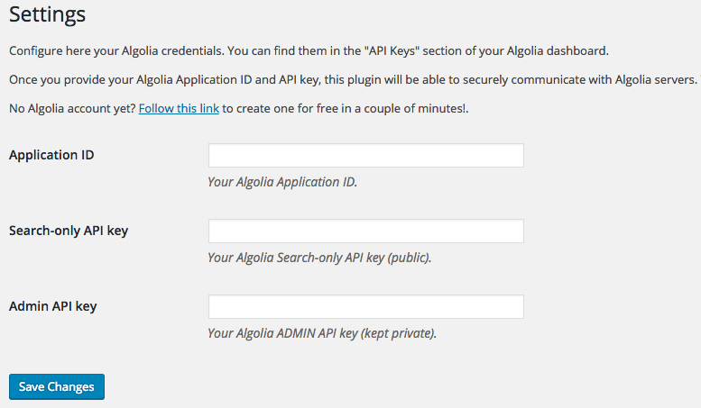
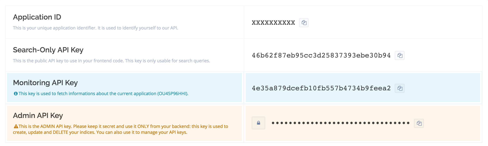
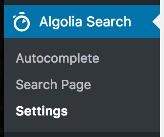
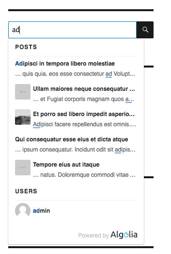
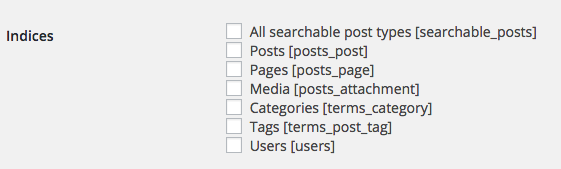
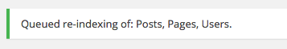
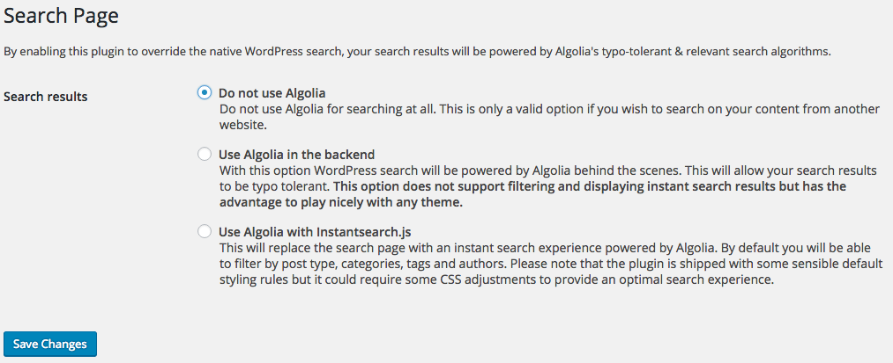
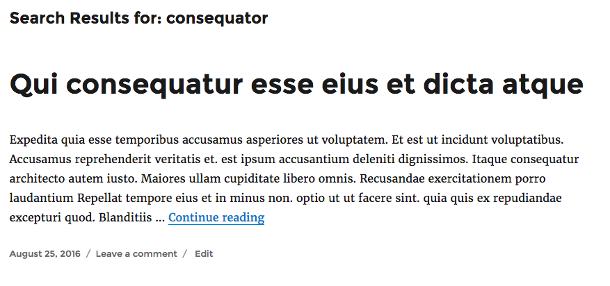
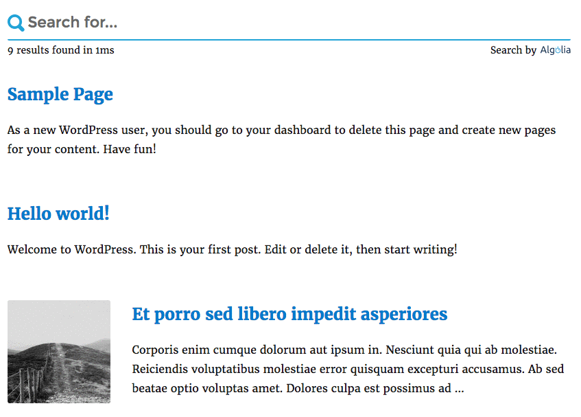

## Algolia Credentials

When connected to the WordPress admin panel, search for the following Algolia Search entry in the left sidebar, and click on it.

You will face the following form asking for your Algolia credentials.

If you have no Algolia account yet, you can create one in a few seconds for free [over here](https://www.algolia.com/users/sign_up).

Once you have created your account and you have signed in, access your Algolia API keys by following [this link](https://www.algolia.com/api-keys).

From that screen you will be able to copy/paste the following necessary keys from the Algolia dashboard to your WordPress admin form:
- Application ID
- Search-Only API Key
- Admin API Key

Copy/pasting these keys manually is very error prone, fortunately there is a convenient little copy button at the right side of each key that will make this easy.

Once you have filled in the 3 required keys, click on the Save Changes button at the bottom of the form.

Once you have correctly provided WordPress with your Algolia keys you will now see the Algolia Search menu entry has also expanded:

## Autocomplete & Indexing

The easiest way to offer your users a nice *find-as-you-type* search experience is through our autocomplete feature, which shows a dropdown menu below the search bar.

Now, let's head to the `Autocomplete` submenu. To enable the Autocomplete feature, tick the box above the configuration table:

Before you can search anything with Algolia, you need to synchronize your data. You should now be facing a list of elements like:

Please note that if you have already installed third party plugins to your WordPress installation, you might have more entries than in the above screenshot which is perfectly fine.

The Algolia Search plugin uses WordPress core features such as **Custom Post Types**, **Custom Taxonomies** or **Users** to find potential content types to index. Any plugin creating new *Post Types* or *Taxonomies* will automatically be listed here an eligible for synchronization with Algolia.

| Setting&nbsp;name         | Description                                                                                                                                                                  |
|:--------------------------|:-----------------------------------------------------------------------------------------------------------------------------------------------------------------------------|
| **Enable**                | Make search results for this index available through the autocomplete.                                                                                                       |
| **Index**                 | The type of data   And the name of the index name in Algolia dashboard |
| **Max.&nbsp;Suggestions** | The maximum number of suggestions to display for this index. Only the `n` most relevant search results will be displayed for this index, and the others will be discarded.   |
| **Position**              | Determines the display position of suggestions in relation to the other autocomplete enabled indices. The bigger the position, the lower the section will be in the display. |

Let's proceed by choosing the indices you want to make searchable on your website, for example **Posts**, **Pages** and **Users**. Simply check the corresponding checkboxes and click on Save Changes.

Green validation messages should confirm that the selected indices are about to be synchronized with Algolia.

Click on the Index now button to quickly send your content to Algolia. After that everything will be kept in sync automatically.

## Search Page

WordPress has a built-in search engine relying on SQL queries. The problem is that it does not support the features of the Algolia search engine such as typo tolerance, custom ranking, and a lot more that you can check out on the [www.algolia.com](https://www.algolia.com) website.

This plugin lets you override WordPress native search with Algolia.

Replacing the WordPress search feature ensures you get the same results than what you see in the *autocomplete* feature.

Once you click on the **Search Page** entry under the **Algolia Search** menu, you will be given 3 options. If you choose "Use Algolia in the backend" or "Use Algolia with Instantsearch.js", the native search will be replaced by Algolia.

### Use Algolia in the backend

With this option WordPress search will be powered by Algolia behind the scenes.

This option does not support filtering and displaying instant search results but has the advantage to play nicely with any theme.

### Use Algolia with Instantsearch.js

With this option WordPress search will be powered by the [instantsearch.js](https://community.algolia.com/instantsearch.js/) library. It replaces your search results page with an instant search experience.

Please note that the plugin is shipped with some sensible default styling rules but it could require some CSS adjustments to provide an optimal search experience.

## From Here On Out

You want to understand more in depth what Algolia is and how you can benefit from it? Please consult our getting started: https://www.algolia.com/doc/guides/getting-started/what-is-algolia/

Struggling with something? Check out the [Q&A section](frequently-asked-questions.html).

