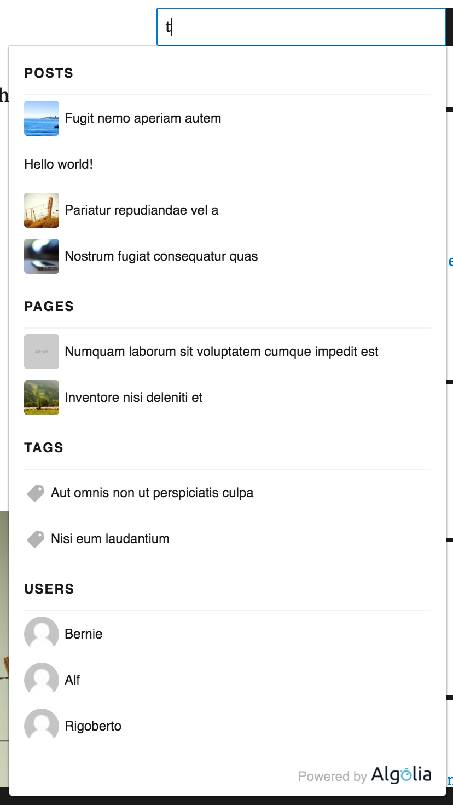
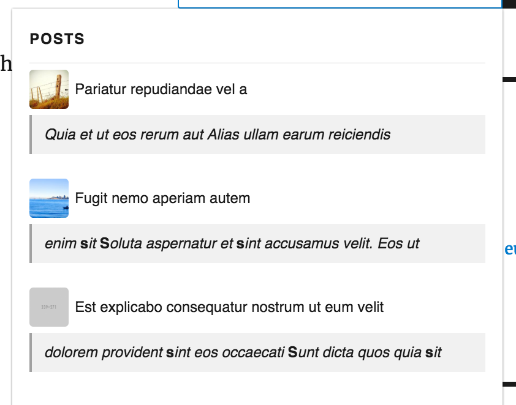

## Introduction

As a reminder, here is what the autocomplete feature looks like by default when you enable it:



This search experience is based on the [Algolia Autocomplete.js library](https://github.com/algolia/autocomplete.js) and by default uses the configuration provided on the Autocomplete admin page of this plugin.

## Resources

Here is a list of resources that are injected into the frontend when we detect that the autocomplete is enabled:

|Type|Name|File Name|Description
|-|-|-
|CSS|algolia-autocomplete|public/css/algolia-autocomplete.css|The default autocomplete styles.
|JS|algolia-autocomplete|public/js/autocomplete.min.js|The official Algolia autocomplete library.
|JS|algolia-search|public/js/algoliasearch.jquery.min.js|The official Algolia JS client to communicate with the API.
|JS|algolia-public-autocomplete|public/js/algolia-public-autocomplete.js|Enables autocomplete according to configuration.
|JS|tether|public/js/tether.min.js|Library that allows to move the search dropdown when it becomes partly hided.


If for whatever reason you want to remove the injection of one of the above static assets, you can do the following:

```php
<?php

function remove_assets() {
	// Remove style by name.
    wp_deregister_style( 'algolia-autocomplete' );

    // Remove script by name.
    wp_deregister_script( 'algolia-public-autocomplete' );
}

add_action( 'algolia_autocomplete_assets', 'remove_assets' );
```

## Customize The Look & Feel

If you simply want to adjust the look & feel of the autocomplete dropdown, we suggest you inject your custom styles from your plugin.

Here are the default styles:
```css
span.algolia-autocomplete {
    display: inherit !important;
}
.aa-dropdown-menu {
    /* we set the width in JS */
    font-family: sans-serif;
    z-index: 999999;
    background-color: #fff;
    border-top: none;
    border-bottom-left-radius: 4px;
    border-bottom-right-radius: 4px;
    box-shadow: 0 1px 2px rgba(0,0,0,.25),0 0 1px rgba(0,0,0,.35);
}

@media only screen and (max-width: 768px) {
    /* For mobile phones: */
    .aa-dropdown-menu {
        min-width: inherit;
        max-width: inherit;
        width: 70%;
    }
}

.aa-dropdown-menu .aa-input, .aa-dropdown-menu .aa-hint {
    width: 100%;
}
.aa-dropdown-menu .aa-hint {
    color: #999;
}

/* Font */
.aa-dropdown-menu {
    color: #1a1a1a;
    font-size: 12px;
}

.aa-dropdown-menu a {
    font-size: 12px;
    color: #1a1a1a;
    font-weight: normal;
    text-decoration: none;
}
.aa-dropdown-menu a:hover {
    text-decoration: none;
}

/* Header */
.aa-dropdown-menu .autocomplete-header {
    margin: 0 14px;
    line-height: 3em;
    border-bottom: 1px solid rgba(0,0,0,.05);
}
.aa-dropdown-menu .autocomplete-header-title,
.aa-dropdown-menu .autocomplete-header-more
{
    letter-spacing: 1px;
    text-transform: uppercase;
    font-weight: bold;
}

.aa-dropdown-menu .autocomplete-header-title {
    float: left;
}

.aa-dropdown-menu .autocomplete-header-more {
    float: right;
}

.aa-dropdown-menu .autocomplete-header-more a {
    color: rgba(0,0,0,.3);
    font-weight: bold;
}

.aa-dropdown-menu .autocomplete-header-more a:hover {
    color:  rgba(0,0,0,.4);
}

/* Suggestion */

.aa-dropdown-menu .aa-suggestion {
    padding: 5px 0;

}

.aa-dropdown-menu .aa-suggestion:after {
    visibility: hidden;
    display: block;
    font-size: 0;
    content: " ";
    clear: both;
    height: 0;
}

.aa-dropdown-menu .aa-suggestion em {
    color: #174d8c;
    background: rgba(143,187,237,.1);
    font-style: normal;
}

.aa-dropdown-menu .aa-suggestion .suggestion-post-title {
    font-weight: bold;
    display: block;
    white-space: nowrap !important;
    text-overflow: ellipsis;
    overflow: hidden;
}

.aa-dropdown-menu .aa-suggestion .suggestion-post-content {
    color: #63676d;
    display: block;
    white-space: nowrap !important;
    text-overflow: ellipsis;
    overflow: hidden;
}

.aa-dropdown-menu .aa-suggestion .suggestion-post-content em {
    padding: 0 0 1px;
    background: inherit;
    box-shadow: inset 0 -2px 0 0 rgba(69,142,225,.8);
    color: inherit;
}

.aa-dropdown-menu .aa-suggestion.aa-cursor {
    background-color: #f9f9f9;

}

.aa-dropdown-menu .aa-suggestion.aa-cursor .suggestion-post-title{
    text-decoration: underline;
}

.aa-dropdown-menu a.suggestion-link {
    display: block;
    padding: 0 14px;
}

.aa-dropdown-menu a.suggestion-link.user-suggestion-link {
    line-height: 32px;
}


.aa-dropdown-menu a.suggestion-link svg {
    vertical-align: middle;
    fill: rgba(0,0,0,.3);
    float: left;
}

.aa-dropdown-menu .suggestion-post-thumbnail {
    float: left;
    margin-right: 5px;
    margin-bottom: 5px;
    border-radius: 3px;
    width: 32px;
    height: 32px;
}

.aa-dropdown-menu .suggestion-user-thumbnail {
    float: left;
    margin-right: 5px;
    margin-bottom: 5px;
    border-radius: 16px;
    width: 32px;
    height: 32px;
}

/* Footer */
.aa-dropdown-menu .autocomplete-footer-branding {
    padding: 15px 14px 0px;
    float: right;
    color: rgba(0,0,0,.3);
    margin-bottom: 7px;
}

.aa-dropdown-menu .autocomplete-footer-branding .algolia-logo {
    width: 55px;
    vertical-align: top;
}

/* Clearfix */
.aa-dropdown-menu .clear {
    clear: both;
}
```

**When designing your autocomplete, turn on the WordPress debug mode to force the autocomplete dropdown to stay open.**

To do so, simply ensure this line is present in your `wp-config.php` file:

```php
<?php
// [...]
define( 'WP_DEBUG', true );
// [...]
```

To properly inject your custom styles into the page only when required, you should do so by reacting to the `algolia_autocomplete_assets` action as follow:

```php
<?php

function custom_autocomplete_assets() {
    wp_enqueue_style( 'custom-autocomplete-styles', get_template_directory_uri() . '/css/custom-autocomplete.css' );
}

add_action( 'algolia_autocomplete_assets' );
```

Read more about injecting styles and scripts in [the WordPress developers documentation](https://developer.wordpress.org/themes/basics/including-css-javascript/).

## Customize Behaviour

This plugin provide with a filter hook to customize the autocomplete configuration.

```php
<?php

function custom_autocomplete_config( $config ) {
	/* Make changes to the default config here and return the array afterwards. */

	return $config;
}

add_filter( 'algolia_autocomplete_config', 'custom_autocomplete_config' );
```

Here is an example of what looks like an autocomplete configuration array:
```
array(4) {
  [0]=>
  array(9) {
    ["name"]=>
    string(15) "post_type__post"
    ["position"]=>
    int(10)
    ["max_suggestions"]=>
    int(5)
    ["distinct"]=>
    bool(true)
    ["label"]=>
    string(5) "Posts"
    ["index"]=>
    string(12) "wp_post_post"
    ["tmpl_suggestion"]=>
    string(28) "autocomplete-post-suggestion"
    ["enabled"]=>
    bool(true)
    ["tmpl_header"]=>
    string(19) "autocomplete-header"
  }
  [1]=>
  array(9) {
    ["name"]=>
    string(15) "post_type__page"
    ["position"]=>
    int(10)
    ["max_suggestions"]=>
    int(2)
    ["distinct"]=>
    bool(true)
    ["label"]=>
    string(5) "Pages"
    ["index"]=>
    string(12) "wp_post_page"
    ["tmpl_suggestion"]=>
    string(28) "autocomplete-post-suggestion"
    ["enabled"]=>
    bool(true)
    ["tmpl_header"]=>
    string(19) "autocomplete-header"
  }
  [2]=>
  array(9) {
    ["name"]=>
    string(18) "taxonomy__post_tag"
    ["position"]=>
    int(20)
    ["max_suggestions"]=>
    int(3)
    ["distinct"]=>
    bool(false)
    ["label"]=>
    string(4) "Tags"
    ["index"]=>
    string(20) "wp_taxonomy_post_tag"
    ["tmpl_suggestion"]=>
    string(28) "autocomplete-term-suggestion"
    ["enabled"]=>
    bool(true)
    ["tmpl_header"]=>
    string(19) "autocomplete-header"
  }
  [3]=>
  array(9) {
    ["name"]=>
    string(5) "users"
    ["position"]=>
    int(30)
    ["max_suggestions"]=>
    int(3)
    ["distinct"]=>
    bool(false)
    ["label"]=>
    string(5) "Users"
    ["index"]=>
    string(8) "wp_users"
    ["tmpl_suggestion"]=>
    string(28) "autocomplete-user-suggestion"
    ["enabled"]=>
    bool(true)
    ["tmpl_header"]=>
    string(19) "autocomplete-header"
  }
}
```

Each item if the configuration represents an index in Algolia. Here are the meanings of the different values:

|Key|Description
|-|-
|name|Used internally as unique way to identify the index. Do not change unless you know what you are doing.
|position|The bigger the value, the most at the bottom the content type results will be displayed.
|max_suggestions|The number of suggestions to display at once for the index.
|label|Displayed as header above the suggestions for the content type.
|index|The index name as for Algolia.
|tmpl_suggestion|The id of the suggestion html without the `tmpl-` prefix.
|enabled|True if this index should be searched on, false otherwise.
|tmpl_header|Same as `tmpl_suggestion` but for header section.

## Customize Template

To display the results suggestion we inject some html templates wrapped into script tags so that they can be handled by the WordPress template preprocessor which in turn is based uglify.

Here is what the post suggestion template looks like:

```html
<script type="text/html" id="tmpl-autocomplete-post-suggestion">
    <a class="suggestion-link" href="{{ data.permalink }}">
        <# if ( data.thumbnail_url ) { #>
            
        <# } #>
    <div class="suggestion-post-attributes">
        <span class="suggestion-post-title">{{{ data._highlightResult.post_title.value }}}</span>

        <#
            var attributes = ['content', 'title6', 'title5', 'title4', 'title3', 'title2', 'title1'];
            var attribute_name;
            var relevant_content = '';
            for ( var index in attributes ) {
                attribute_name = attributes[ index ];
                if ( data._highlightResult[ attribute_name ].matchedWords.length > 0 ) {
                    relevant_content = data._snippetResult[ attribute_name ].value;
                    break;
                } else if( data._snippetResult[ attribute_name ].value !== '' ) {
                    relevant_content = data._snippetResult[ attribute_name ].value;
                }
            }
            #>
        <span class="suggestion-post-content">{{{ relevant_content }}}</span>
    </div>
    </a>
</script>
```

The `data` represent the Algolia single hit item. You can access all the indexed attributes. For a complete list of default attributes, see [this page](index-schema.md).

If you have pushed custom attributes, you will also be able to access them.

In this example we also use some of the features of Algolia like highlighting matched strings. For a complete list of features, please checkout the [official Algolia documentation](https://www.algolia.com/doc/).

Let's say that you now want to add the content excerpt of posts in the suggestions. In that case you would need to:

- Inject your custom html template,
- Adjust the CSS for obtaining a correct look & feel.

To replace the default templates with yours you can use the `algolia_autocomplete_templates` filter.

By default, here is the list of templates we use:

```php
<?php

$templates = array(
	'header'          => plugin_dir_path( __FILE__ ) . 'partials/algolia-autocomplete-header.php',
  	'post-suggestion' => plugin_dir_path( __FILE__ ) . 'partials/algolia-autocomplete-post-suggestion.php',
  	'term-suggestion' => plugin_dir_path( __FILE__ ) . 'partials/algolia-autocomplete-term-suggestion.php',
  	'user-suggestion' => plugin_dir_path( __FILE__ ) . 'partials/algolia-autocomplete-user-suggestion.php',
  	'footer'          => plugin_dir_path( __FILE__ ) . 'partials/algolia-autocomplete-footer.php',
  	'empty'           => plugin_dir_path( __FILE__ ) . 'partials/algolia-autocomplete-empty.php',
);
```

Now lets replace the post template with your custom one:

```html
<script type="text/html" id="tmpl-autocomplete-post-suggestion">
	<a class="suggestion-link" href="{{ data.permalink }}">
		<# if ( data.thumbnail_url ) { #>
			
		<# } #>
		<span class="suggestion-post-title">{{{ data._highlightResult.post_title.value }}}</span>
		<br>
		<span class="suggestion-content">
			<# if ( data._snippetResult.content.value ) { #>
				{{{ data._snippetResult.content.value }}}
			<# } #>
		</span>
	</a>
</script>
<style>
	.suggestion-link .suggestion-content {
		white-space: normal;
		font-style: italic;
		margin: 5px 0 10px;
		display: inline-block;
		border-left: 2px solid #A1A1A1;
		padding: 0 10px;
		background: #f1f1f1;
		width: 100%;
	}
</style>
```

<div class="alert alert-warning">Note that we have inlined the styles for the sake of briefness. In your project, inject your CSS properly as explained previously on this page.</div>

Now let's override the default template:

```php
<?php

function custom_autocomplete_templates( $templates ) {
	$templates['post-suggestion'] = plugin_dir_path( __FILE__ ) . 'custom-autocomplete-post-suggestion.php';

	return $templates;
}

add_filter( 'algolia_autocomplete_templates', 'custom_autocomplete_templates' );
```

Here is what you would get:



## Advanced Templating

If you want to go further, you could also manually override every templates directly in the config.

For example, let's say that you want a special template only for the post type "page".

```php
<?php

// Register our new template for injection into the footer of the html.
function custom_autocomplete_templates( $templates ) {
	$templates['post-page-suggestion'] = plugin_dir_path( __FILE__ ) . 'custom-autocomplete-post-page-suggestion.php';

	return $templates;
}

add_filter( 'algolia_autocomplete_templates', 'custom_autocomplete_templates' );


// Assign the template ID for the chosen page post type.
function custom_page_template( $config ) {
	foreach ( $config as &$source ) {
		if ( 'post_type__page' === $source['name'] ) {
			$source['tmpl_suggestion'] = 'autocomplete-post-page-suggestion';
			break;
		}
	}

	return $config;
}

add_filter( 'algolia_autocomplete_config', 'custom_page_template' );
```
