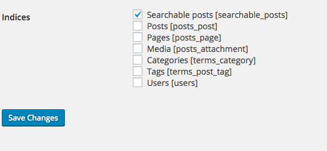
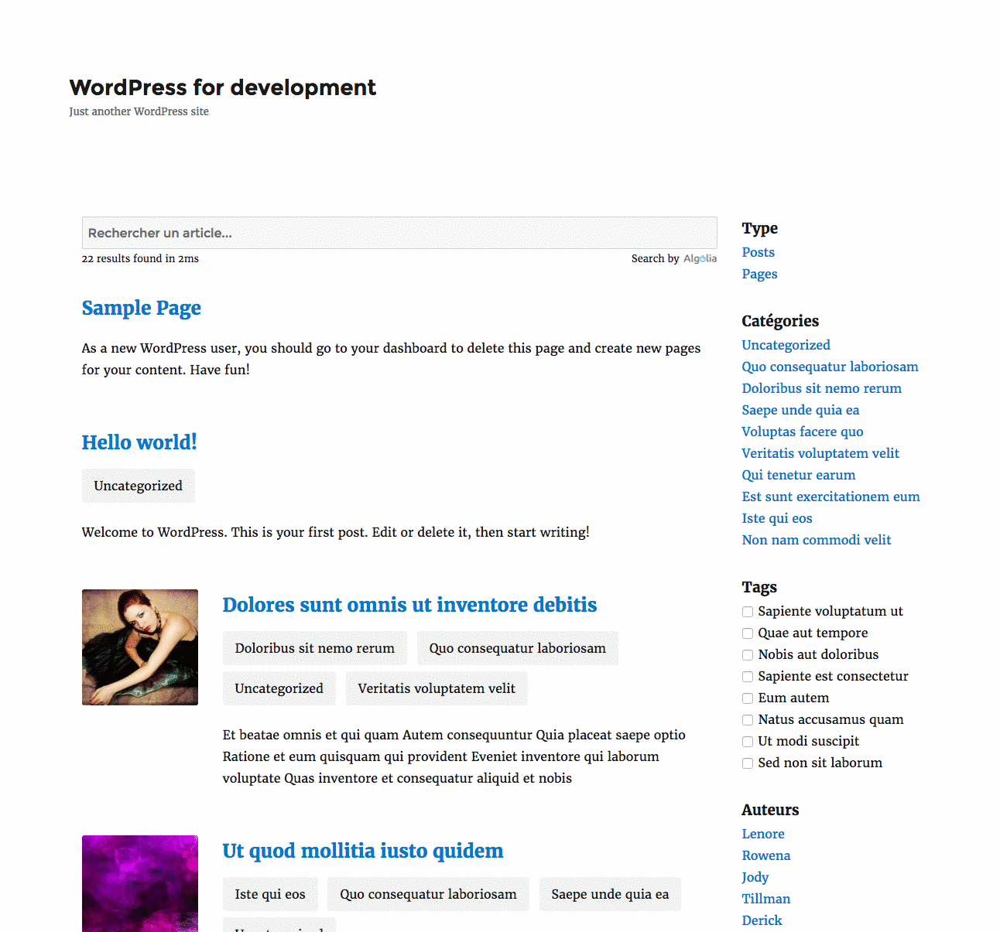

## Introduction

Instantsearch.js is a javascript library that eases the process of building rich search experiences.

Please checkout the [official website of the instantsearch.js website](https://community.algolia.com/instantsearch.js/).

Also take a look at some examples of [what can be achieved with instantsearch.js](https://community.algolia.com/instantsearch.js/examples/).

## Implementing Instantsearch.js

Every WordPress theme being different, we do not ship a plug & play feature for building Instantsearch.js pages.

That said, we provide with a default implementation to get you started quickly.
1. Create the css/ais-wp.css file into your theme directory
2. Create the js/ais-wp.js file into your theme directory
3. Create a search.php template file in your theme directory. If it already exist you could try to merge the content we provide with your own.
4. Create or add the enqueuing of the css and js files into your theme function.js file

[Checkout the files in this Gist](https://gist.github.com/rayrutjes/0814a08ec0ad78e370299b572840405b)

By default the instantsearch.js implementation is based on the `Searchable Posts Index`. Please be sure that the corresponding index was flagged for sync on the admin `Indexing` page.

From here, you should now have a working instantsearch.js experience like:

## Customizing Implementation

You can customize the look and feel by editing the `ais-wp.css` file you copied into your theme directory.

You customize the javascript implementation in the `ais-wp.js`.

And you can of course edit the html in `search.php`.

Whatever changes you make, be sure to understand how the instantsearch.js library works by checking out the [official documentation](https://community.algolia.com/instantsearch.js/documentation/).

