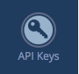
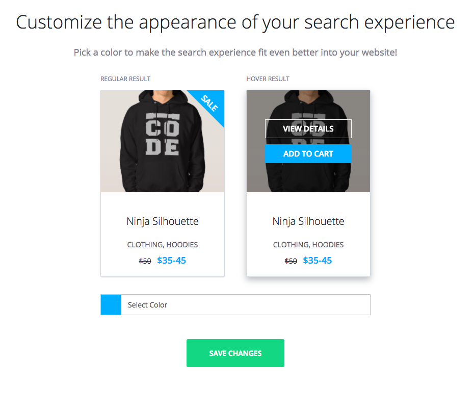

## Introduction

**The Algolia plugin for WooCommerce is provided as is and may require some developer workforce in order to get it integrated & adapted to your store. No support specific for WooCommerce will be delivered.**

[WooCommerce](https://wordpress.org/plugins/woocommerce/) is the most famous plugin for turning your WordPress into a store.

## Requirements

Algolia Search plugin for WooCommerce has a few system requirements to be able to work properly.

You will need to make sure your server meets the following requirements:

- WordPress 4.4+
- [WooCommerce plugin](https://wordpress.org/plugins/woocommerce/) 3.0+
- [Algolia plugin for WordPress](https://wordpress.org/plugins/search-by-algolia-instant-relevant-results/) 1.6+
- PHP 5.6 or greater
- MySQL 5.6 or greater
- cURL PHP extension
- mbstring PHP extension

## Installation

For the Algolia plugin for WooCommerce to work you will need have the following plugins installed:

- Algolia search: https://wordpress.org/plugins/search-by-algolia-instant-relevant-results/
- WooCommerce: https://wordpress.org/plugins/woocommerce/

Once that is the case, you can install the Algolia plugin for WooCommerce that you can clone from: https://github.com/algolia/algoliasearch-woocommerce

If you need further help with the installation process, please give the [installation guide](https://wordpress.org/plugins/search-by-algolia-instant-relevant-results/installation/) a try.

## Create an Algolia account

If you haven't got an Algolia account, now is a good time to create one by subscribing [here](https://www.algolia.com/users/sign_up).

You don't need to push your data as suggested in the onboarding tutorial as this plugin will handle it for you.

## Fill in your Algolia credentials

Now that your Algolia account is created, head to the `API keys` page:

In your WordPress admin panel, head to the Algolia Search link in the left sidebar:

Copy the API keys from the Algolia website to your website instance and hit the Save changes button.

## Index products

The Algolia Search menu in the left sidebar should now be expanded:

Head to the indexing page, check the `Products [posts_product]` index and hit the Save changes.

This will trigger the indexing of the products. While this is taking place you can continue the configuration of the plugin because indexing is done in the background.

## Choose on what pages to display the instant search experience

Head to the WooCommerce menu entry of the Algolia Search plugin:

Choose on what page types you want to inject the search on and hit the Save changes.

## Choose where to inject your search inside of the pages

The plugin requires a CSS selector to be able to determine where to inject the search inside of the pages.

To make this process as simple as possible, on the `Zoning` page we load the first category of your website so that you simply have to click on the area where you'd like to see the search injected.

Please note that sometimes you will need to manually adjust the detected selector depending on how your theme's HTML is structured.

Once you chose your selector, you can hit the Save changes.

You'll get a notification in the frontend if the selector you configured does not match any element. This notification only displays if you are the admin.

## Customize the appearance

Finally head to the `Appearance` tab:

Select a color that matches your theme and hit the Save changes.

This will automatically change the color of all search UI components on your website:

